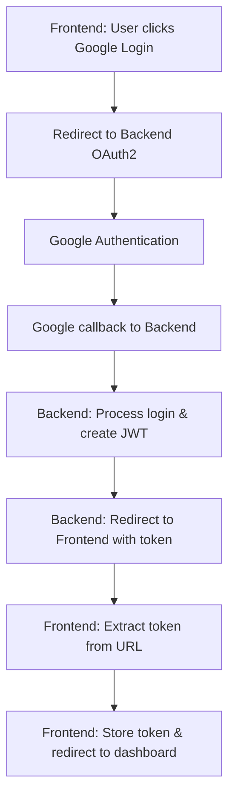

# 🌐 Hướng dẫn tích hợp OAuth2 cho Frontend

## 📋 **Tổng quan:**

Backend đã được cấu hình để redirect về frontend sau khi đăng nhập OAuth2 thành công, kèm theo JWT token và thông tin user.

---

## ⚙️ **Cấu hình Backend đã hoàn thành:**

### **✅ 1. Frontend URLs (application.yaml):**
```yaml
# OAuth2 Frontend Integration
oauth2:
  frontend:
    base-url: ${FRONTEND_URL:http://localhost:3000}
    success-path: ${OAUTH2_SUCCESS_PATH:/oauth2/success}
    failure-path: ${OAUTH2_FAILURE_PATH:/login?error=oauth2_failed}
```

### **✅ 2. CORS Configuration:**
```java
// Cho phép frontend domain
configuration.setAllowedOriginPatterns(Arrays.asList(
    "http://localhost:3000",    // Frontend
    "http://localhost:8080",    // Backend
    "http://127.0.0.1:3000",    // Alternative
    "http://127.0.0.1:8080"     // Alternative
));
```

### **✅ 3. OAuth2 Success Handler:**
- Tự động xử lý login thành công
- Truyền JWT token qua URL parameters
- Redirect về frontend với thông tin user

---

## 🔗 **OAuth2 Flow cho Frontend:**

### **📊 Complete Flow:**


### **🔗 URLs:**

1. **Google Login Button (Frontend):**
   ```html
   <a href="http://localhost:8080/oauth2/authorization/google">
       Đăng nhập với Google
   </a>
   ```

2. **Success Redirect (Backend → Frontend):**
   ```
   http://localhost:3000/oauth2/success?success=true&token=JWT_TOKEN&email=user@gmail.com&role=KHACH_HANG&userId=ND1A77DF8A
   ```

3. **Failure Redirect (Backend → Frontend):**
   ```
   http://localhost:3000/login?error=oauth2_failed
   ```

---

## 🎯 **Frontend Implementation:**

### **1️⃣ React/Vue/Angular - OAuth2 Success Page:**

```javascript
// /oauth2/success page component
import { useEffect } from 'react';
import { useRouter } from 'next/router'; // Next.js example

export default function OAuth2Success() {
    const router = useRouter();
    
    useEffect(() => {
        const handleOAuth2Success = () => {
            // Extract parameters from URL
            const urlParams = new URLSearchParams(window.location.search);
            const success = urlParams.get('success');
            const token = urlParams.get('token');
            const email = urlParams.get('email');
            const role = urlParams.get('role');
            const userId = urlParams.get('userId');
            
            if (success === 'true' && token) {
                // Store JWT token
                localStorage.setItem('jwt_token', token);
                localStorage.setItem('user_email', email);
                localStorage.setItem('user_role', role);
                localStorage.setItem('user_id', userId);
                
                console.log('✅ OAuth2 Login successful!');
                console.log('Token:', token);
                console.log('User:', { email, role, userId });
                
                // Redirect to dashboard
                router.push('/dashboard');
            } else {
                console.error('❌ OAuth2 Login failed');
                router.push('/login?error=oauth2_failed');
            }
            
            // Clean URL (remove parameters)
            window.history.replaceState({}, document.title, '/oauth2/success');
        };
        
        handleOAuth2Success();
    }, [router]);
    
    return (
        <div className="oauth2-processing">
            <h2>🔄 Đang xử lý đăng nhập...</h2>
            <p>Vui lòng chờ trong giây lát...</p>
        </div>
    );
}
```

### **2️⃣ Vanilla JavaScript:**

```html
<!DOCTYPE html>
<html>
<head>
    <title>OAuth2 Success</title>
</head>
<body>
    <div id="loading">
        <h2>🔄 Đang xử lý đăng nhập...</h2>
        <p>Vui lòng chờ trong giây lát...</p>
    </div>

    <script>
        function handleOAuth2Success() {
            // Extract parameters from URL
            const urlParams = new URLSearchParams(window.location.search);
            const success = urlParams.get('success');
            const token = urlParams.get('token');
            const email = urlParams.get('email');
            const role = urlParams.get('role');
            const userId = urlParams.get('userId');
            
            if (success === 'true' && token) {
                // Store JWT token
                localStorage.setItem('jwt_token', token);
                localStorage.setItem('user_email', email);
                localStorage.setItem('user_role', role);
                localStorage.setItem('user_id', userId);
                
                console.log('✅ OAuth2 Login successful!');
                console.log('Token:', token);
                console.log('User:', { email, role, userId });
                
                // Redirect to dashboard
                window.location.href = '/dashboard';
            } else {
                console.error('❌ OAuth2 Login failed');
                window.location.href = '/login?error=oauth2_failed';
            }
        }
        
        // Execute when page loads
        window.addEventListener('load', handleOAuth2Success);
    </script>
</body>
</html>
```

### **3️⃣ API Calls với JWT Token:**

```javascript
// Utility function để gọi API với JWT token
async function apiCall(endpoint, options = {}) {
    const token = localStorage.getItem('jwt_token');
    
    if (!token) {
        throw new Error('No JWT token found');
    }
    
    const defaultOptions = {
        headers: {
            'Authorization': `Bearer ${token}`,
            'Content-Type': 'application/json',
            ...options.headers
        }
    };
    
    const response = await fetch(`http://localhost:8080${endpoint}`, {
        ...options,
        ...defaultOptions,
        headers: { ...defaultOptions.headers, ...options.headers }
    });
    
    if (!response.ok) {
        if (response.status === 401) {
            // Token expired or invalid
            localStorage.removeItem('jwt_token');
            window.location.href = '/login';
            return;
        }
        throw new Error(`API call failed: ${response.statusText}`);
    }
    
    return response.json();
}

// Usage examples:
async function fetchUserProfile() {
    try {
        const userData = await apiCall('/api/user/profile');
        console.log('User profile:', userData);
    } catch (error) {
        console.error('Error fetching profile:', error);
    }
}

async function fetchProducts() {
    try {
        const products = await apiCall('/api/sanpham');
        console.log('Products:', products);
    } catch (error) {
        console.error('Error fetching products:', error);
    }
}
```

---

## 🔒 **Security Best Practices:**

### **✅ Token Storage:**
```javascript
// ✅ GOOD: Use localStorage for SPA
localStorage.setItem('jwt_token', token);

// ✅ BETTER: Use sessionStorage for more security
sessionStorage.setItem('jwt_token', token);

// ✅ BEST: Use httpOnly cookies (requires backend setup)
// Set via backend Set-Cookie header
```

### **✅ Token Validation:**
```javascript
function isTokenValid() {
    const token = localStorage.getItem('jwt_token');
    if (!token) return false;
    
    try {
        // Decode JWT payload (without verification)
        const payload = JSON.parse(atob(token.split('.')[1]));
        const now = Math.floor(Date.now() / 1000);
        
        // Check if token is expired
        return payload.exp > now;
    } catch (error) {
        return false;
    }
}

// Check token before making API calls
if (!isTokenValid()) {
    localStorage.removeItem('jwt_token');
    window.location.href = '/login';
}
```

### **✅ Auto-refresh Token:**
```javascript
// Optional: Auto-refresh token when near expiration
async function autoRefreshToken() {
    const token = localStorage.getItem('jwt_token');
    if (!token) return;
    
    try {
        const payload = JSON.parse(atob(token.split('.')[1]));
        const now = Math.floor(Date.now() / 1000);
        const timeUntilExpiry = payload.exp - now;
        
        // Refresh if expires in less than 5 minutes
        if (timeUntilExpiry < 300) {
            const response = await apiCall('/api/oauth2/get-token');
            if (response.success) {
                localStorage.setItem('jwt_token', response.result.jwt_token);
            }
        }
    } catch (error) {
        console.error('Auto-refresh failed:', error);
    }
}

// Run every 1 minute
setInterval(autoRefreshToken, 60000);
```

---

## 🛠️ **Environment Variables:**

### **Backend (.env hoặc application.yaml):**
```properties
# Production
FRONTEND_URL=https://your-frontend-domain.com
OAUTH2_SUCCESS_PATH=/oauth2/success
OAUTH2_FAILURE_PATH=/login?error=oauth2_failed

# Development
FRONTEND_URL=http://localhost:3000
```

### **Frontend (.env):**
```properties
# Development
REACT_APP_API_BASE_URL=http://localhost:8080
REACT_APP_OAUTH2_LOGIN_URL=http://localhost:8080/oauth2/authorization/google

# Production
REACT_APP_API_BASE_URL=https://your-backend-domain.com
REACT_APP_OAUTH2_LOGIN_URL=https://your-backend-domain.com/oauth2/authorization/google
```

---

## 🧪 **Testing:**

### **1. Test OAuth2 Flow:**
1. **Frontend**: Click Google login button
2. **Expected**: Redirect to Google OAuth2
3. **After Google login**: Redirect back to frontend with token
4. **Frontend**: Extract and store token
5. **Test API call**: Use stored token

### **2. Test API Calls:**
```javascript
// Test protected endpoint
async function testProtectedAPI() {
    try {
        const response = await apiCall('/api/user/profile');
        console.log('✅ API call successful:', response);
    } catch (error) {
        console.error('❌ API call failed:', error);
    }
}
```

### **3. Test Token Expiration:**
```javascript
// Manually expire token for testing
localStorage.setItem('jwt_token', 'expired_token');
// Then try API call - should redirect to login
```

---

## 🎉 **Ready to Use!**

### **✅ Backend Configured:**
- ✅ OAuth2 redirect về frontend
- ✅ JWT token trong URL parameters
- ✅ CORS cho phép frontend domain
- ✅ Custom success handler

### **🎯 Frontend Requirements:**
- ✅ `/oauth2/success` route để handle redirect
- ✅ Extract token từ URL parameters  
- ✅ Store token trong localStorage/sessionStorage
- ✅ Use token cho API calls với `Authorization: Bearer` header

**Your OAuth2 integration is now ready for frontend!** 🚀
