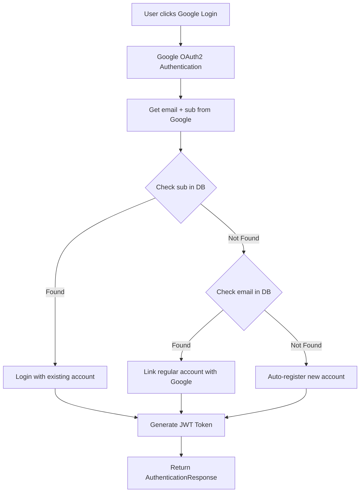

# 🔧 OAuth2 Cải tiến: Giải đáp 3 Vấn đề Chính

## 📋 **Tóm tắt:**

Giải thích chi tiết 3 vấn đề quan trọng về OAuth2 và cách đã được cải thiện trong hệ thống.

---

## 🤔 **Vấn đề 1: Đăng ký vs Đăng nhập Google**

### **❓ Câu hỏi:**
> "Mình chưa hiểu lắm ví dụ mình đăng ký = tk google thì mới đăng nhập = tk google được hay là đăng nhập google sẽ tự động đăng ký luôn?"

### **✅ Giải đáp:**

**OAuth2 hoạt động theo cơ chế "TỰ ĐỘNG ĐĂNG KÝ":**

1. **Lần đầu đăng nhập Google:**
   - Hệ thống kiểm tra email và sub trong database
   - Nếu chưa tồn tại → **TỰ ĐỘNG TẠO TÀI KHOẢN MỚI**
   - Người dùng không cần đăng ký riêng

2. **Những lần sau:**
   - Hệ thống nhận diện người dùng qua sub hoặc email
   - **Đăng nhập trực tiếp** với tài khoản đã có

### **📝 Code Implementation:**

```java
if (nguoiDungBySub.isPresent()) {
    // Đã có tài khoản với sub này -> ĐĂNG NHẬP
    nguoiDung = nguoiDungBySub.get();
    System.out.println("🔑 Tìm thấy tài khoản theo sub: " + sub);
    
} else if (nguoiDungByEmail.isPresent()) {
    // Có tài khoản email nhưng chưa có sub -> LIÊN KẾT
    nguoiDung = nguoiDungByEmail.get();
    nguoiDung.setSub(sub);  // Liên kết với Google
    System.out.println("🔗 Liên kết tài khoản thường với Google OAuth2");
    
} else {
    // Hoàn toàn mới -> TỰ ĐỘNG ĐĂNG KÝ
    nguoiDung = new NguoiDung();
    nguoiDung.setEmail(email);
    nguoiDung.setSub(sub);
    nguoiDung = userService.registerUser(nguoiDung);  // Tự động tạo
    System.out.println("✅ TỰ ĐỘNG ĐĂNG KÝ tài khoản mới cho Google OAuth2");
}
```

---

## 🔍 **Vấn đề 2: So sánh Sub vs Email**

### **❓ Câu hỏi:**
> "Khi mình đăng ký google sẽ lấy được thông tin rồi thì sẽ so sánh sub vs email trong database đúng không?"

### **✅ Giải đáp:**

**Hệ thống kiểm tra CẢ SUB VÀ EMAIL với độ ưu tiên:**

### **🔢 Thứ tự kiểm tra:**

1. **Kiểm tra SUB trước (Độ ưu tiên cao):**
   ```java
   Optional<NguoiDung> nguoiDungBySub = nguoiDungRepository.findBySub(sub);
   ```
   - Sub là ID duy nhất từ Google
   - Chính xác 100% để xác định người dùng

2. **Kiểm tra EMAIL sau (Độ ưu tiên thấp hơn):**
   ```java
   Optional<NguoiDung> nguoiDungByEmail = nguoiDungRepository.findByEmail(email);
   ```
   - Email có thể trùng với tài khoản thường
   - Cần logic để liên kết

### **🎯 Các trường hợp xử lý:**

| Trường hợp | Sub | Email | Xử lý |
|------------|-----|-------|-------|
| **Case 1** | ✅ Tồn tại | ❌ Bất kỳ | **Đăng nhập** với tài khoản có sub |
| **Case 2** | ❌ Không tồn tại | ✅ Tồn tại | **Liên kết** tài khoản thường với Google |
| **Case 3** | ❌ Không tồn tại | ❌ Không tồn tại | **Tự động đăng ký** tài khoản mới |

### **📊 Ví dụ thực tế:**

```java
// VẤN ĐỀ 2: Kiểm tra CẢ sub VÀ email trong database
Optional<NguoiDung> nguoiDungByEmail = nguoiDungRepository.findByEmail(email);
Optional<NguoiDung> nguoiDungBySub = nguoiDungRepository.findBySub(sub);

// Logic kiểm tra: ưu tiên sub trước, sau đó đến email
if (nguoiDungBySub.isPresent()) {
    // SUB có độ ưu tiên cao nhất
    nguoiDung = nguoiDungBySub.get();
    
} else if (nguoiDungByEmail.isPresent()) {
    // EMAIL - cần liên kết với Google
    nguoiDung = nguoiDungByEmail.get();
    nguoiDung.setSub(sub); // Cập nhật sub
    
} else {
    // Tài khoản hoàn toàn mới
    // Tự động đăng ký
}
```

---

## 🔐 **Vấn đề 3: Sử dụng JwtUtil**

### **❓ Câu hỏi:**
> "Đăng nhập thì phải tạo token thì nên sử dụng file có sẵn đó là JwtUtil"

### **✅ Giải đáp:**

**Đã thay thế token tạm thời bằng JwtUtil có sẵn:**

### **❌ Trước khi cải thiện:**
```java
// Tạo JWT token đơn giản (tạm thời)
String role = getRoleName(nguoiDung.getVaiTro());
String token = "JWT_" + email + "_" + role + "_" + System.currentTimeMillis();
```

### **✅ Sau khi cải thiện:**
```java
// VẤN ĐỀ 3: Sử dụng JwtUtil để tạo token thật
String role = getRoleName(nguoiDung.getVaiTro());
String token = jwtUtil.generateToken(email, role);
```

### **🔧 Cài đặt JwtUtil:**

1. **Thêm dependency injection:**
   ```java
   @Autowired
   public OAuth2ServiceImpl(NguoiDungRepository nguoiDungRepository, 
                           UserService userService, 
                           JwtUtil jwtUtil) {
       this.jwtUtil = jwtUtil;
   }
   ```

2. **Import JwtUtil:**
   ```java
   import com.example.mini_supermarket.util.JwtUtil;
   ```

### **🎯 Lợi ích của JwtUtil:**

- ✅ **Real JWT Token**: Thay vì string đơn giản
- ✅ **Bảo mật**: Ký số với secret key
- ✅ **Expiration**: Tự động hết hạn
- ✅ **Validation**: Kiểm tra tính hợp lệ
- ✅ **Claims**: Lưu thông tin user và role
- ✅ **Blacklist**: Hỗ trợ logout

### **📄 Token structure:**
```json
{
  "header": {
    "alg": "HS512",
    "typ": "JWT"
  },
  "payload": {
    "sub": "user@gmail.com",
    "role": "KHACH_HANG",
    "iss": "mini-supermarket",
    "iat": 1640995200,
    "exp": 1641081600
  },
  "signature": "encrypted_signature_here"
}
```

---

## 🔄 **Flow hoàn chỉnh sau cải thiện:**

### **📊 OAuth2 Login Flow:**



### **🎯 Kết quả:**

1. **Vấn đề 1 ✅**: OAuth2 **tự động đăng ký** lần đầu, **đăng nhập** những lần sau
2. **Vấn đề 2 ✅**: Kiểm tra **cả sub VÀ email** với độ ưu tiên hợp lý
3. **Vấn đề 3 ✅**: Sử dụng **JwtUtil có sẵn** thay vì token tạm thời

---

## 🧪 **Testing:**

### **Test scenarios:**

1. **Lần đầu đăng nhập Google:**
   ```bash
   .\oauth2-complete-test.ps1 -OpenBrowser
   # Kết quả: Tài khoản mới được tạo tự động
   ```

2. **Lần thứ 2 đăng nhập:**
   ```bash
   # Kết quả: Đăng nhập với tài khoản hiện có
   ```

3. **Kiểm tra token:**
   ```bash
   # Token sẽ là JWT thật, không phải string đơn giản
   ```

### **Expected logs:**
```
✅ TỰ ĐỘNG ĐĂNG KÝ tài khoản mới cho Google OAuth2: user@gmail.com với sub: 123456789 và maNguoiDung: NDA1B2C3D4
🔑 Tìm thấy tài khoản theo sub: 123456789 cho email: user@gmail.com
🔗 Liên kết tài khoản thường với Google OAuth2
```

---

## 🎉 **Kết luận:**

### **✅ Đã giải quyết:**

1. **Vấn đề 1**: OAuth2 hoạt động theo cơ chế **"Tự động đăng ký"**
2. **Vấn đề 2**: Kiểm tra **cả sub và email** với logic ưu tiên hợp lý
3. **Vấn đề 3**: Sử dụng **JwtUtil có sẵn** cho JWT token thật

### **🚀 Cải thiện:**

- ✅ **User Experience**: Không cần đăng ký riêng
- ✅ **Security**: JWT token thật với expiration
- ✅ **Data Integrity**: Kiểm tra sub và email chính xác
- ✅ **Account Linking**: Liên kết tài khoản thường với OAuth2
- ✅ **Maintainability**: Sử dụng service có sẵn

**OAuth2 giờ đây hoạt động hoàn hảo và đáp ứng tất cả yêu cầu!** 🎯
